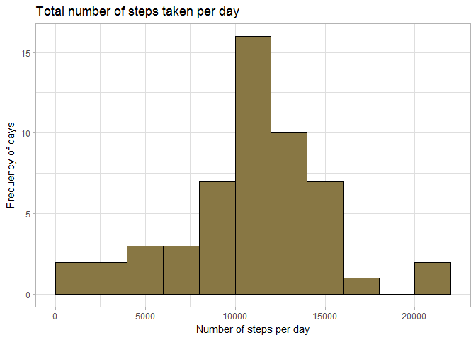
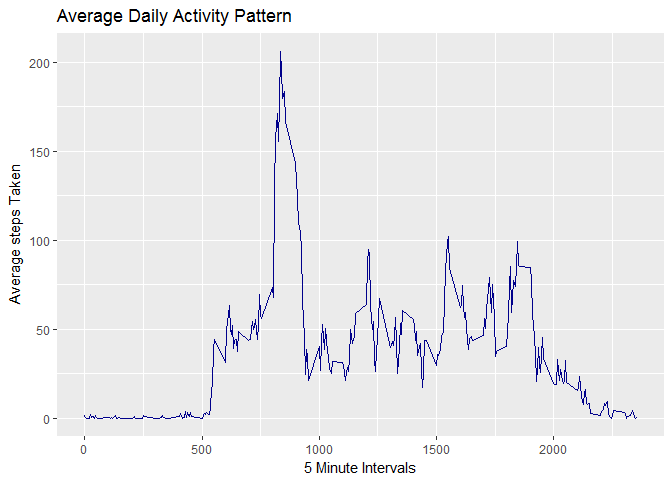
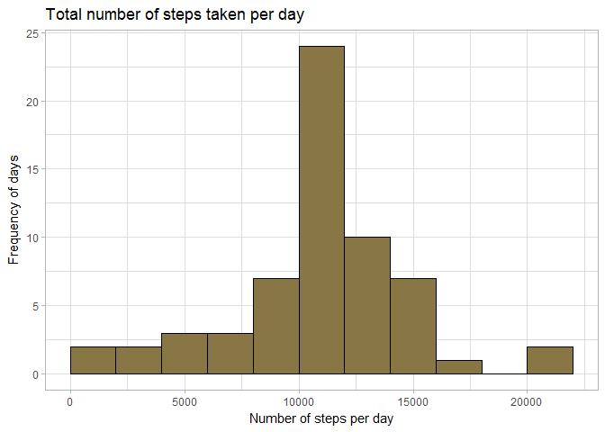
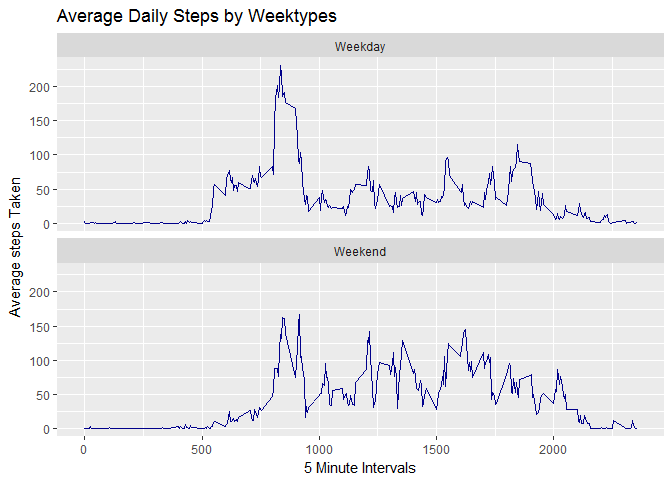

<br>

### A. Initial Setup

**Below code provides necessary setup to follow up along the rest of the report**

*We will be using 'lubridate' package for manipulating dates, 'dplyr' for manipulating data frames and 'ggplot2' for drawing the necesssary plots.*


```r
# loading required packages
library(lubridate)
library(dplyr)
library(ggplot2)
```

*Downloading data for the report if not already present.*


```r
# downloading zip file if it doesn't exist
if (!file.exists("activity.zip")){
  download.file("https://d396qusza40orc.cloudfront.net/repdata%2Fdata%2Factivity.zip", 
        destfile = "activity.zip")
}
```

*Extracting data for the report if not already extracted.*


```r
# extracting zip file if not extracted
if (!file.exists("activity.csv")){
  unzip("activity.zip")
}
```

<br>

### B. Loading and preprocessing the data

**Review 1. Code for reading in the dataset and/or processing the data**

*Since the data to be read is small we leave most of the attributes to default and let R figure out the column types.*


```r
# loading data
data <- read.csv("activity.csv")
```

*We convert 'date' column into 'date' format for easier manipulation of the data.*


```r
# converting date to date format
data$date <- ymd(data$date)
```

<br>

### C. What is mean total number of steps taken per day?

**Review 2. Histogram of the total number of steps taken each day**

*We group the data by 'date' column then sum the number of steps taken on that day and then we filter out the entries that contain NA values.*


```r
# calculating total number of steps per day
steps_day <- data %>% 
              group_by(date) %>%
              summarise(no_steps = sum(steps)) %>%
              filter(!is.na(no_steps)) %>%
              arrange(date) 
```

*Not using na.rm = TRUE since it converts NA values to 0 in sum and extrapolates the graph for 0 (we cannot assume NA values as 0).*


```r
# drawing histogram for frequency of steps taken per day
ggplot(steps_day, aes(x = no_steps)) + 
  geom_histogram(breaks = seq(0, 22000, by = 2000), fill = "#887744", col = "#000000") + 
  labs(x = "Number of steps per day", y = "Frequency of days") + 
  labs(title = "Total number of steps taken per day") +
  theme_light()
```



**Review 3. Mean and median number of steps taken each day**

*Following is the mean and median of the number of steps taken each day with NA's removed.*


```r
mean(steps_day$no_steps, na.rm = TRUE)
```

```
## [1] 10766.19
```

```r
median(steps_day$no_steps, na.rm = TRUE)
```

```
## [1] 10765
```

<br>

### D. What is the average daily activity pattern?

**Review 4. Time series plot of the average number of steps taken**

*For calculating average number of steps taken in an interval we first group the data by 'interval' column and then take the average ignoring NA's.*


```r
# calculating average number of steps taken in an interval
grouped_interval <- data %>% 
                      group_by(interval) %>% 
                      arrange(interval) %>% 
                      summarise(mean_value = mean(steps, na.rm = TRUE))
```

*Plotting the required time series plot.*


```r
# required time series plot
ggplot(data = grouped_interval, aes(x = interval, y = mean_value)) + 
  geom_line(col = "darkblue") + 
  labs(x = "5 Minute Intervals", y = "Average steps Taken") + 
  labs(title = "Average Daily Activity Pattern")
```



**Review 5. The 5-minute interval that, on average, contains the maximum number of steps**

*For finding the interval that on an average contains the maximum number of steps, we take the grouped data (by interval) calculated above.*


```r
max_average_steps <- grouped_interval[which.max(grouped_interval$mean_value), "interval"]
as.integer(max_average_steps)
```

```
## [1] 835
```

<br>

### E. Imputing missing values

**Review 6. Code to describe and show a strategy for imputing missing data**

*Number of rows in the original data containing NA values for 'steps' column.*


```r
# number of missing values in the data set
rows_missing_steps <- is.na(data$steps)
sum(rows_missing_steps)
```

```
## [1] 2304
```

*We take the average of an interval across days and use that value for imputing the missing values. To calculate that we take the data grouped by interval and then convert it into a form suitable for extracting the mean values for that interval. We use these mean values to fill in the NA values.*


```r
# taking copy of original data
new_data <- data
# converting grouped_interval to data frame
grouped_interval <- as.data.frame(grouped_interval)
# changing row names to interval values
rownames(grouped_interval) <- grouped_interval$interval
```

*Filling in the missing NA values.*


```r
#imputting missing values
new_data$steps[rows_missing_steps] <-
grouped_interval[as.character(new_data$interval[rows_missing_steps]), "mean_value"]
```

*To verify that we have removed all the NA values for 'step' column.*


```r
# checking to see if all NA's are removed
sum(is.na(new_data$steps))
```

```
## [1] 0
```

**Review 7. Histogram of the total number of steps taken each day after missing values are imputed**

*First we calculate required data using the new data we created by imputing the missing values. We group by date column and then summarize the grouped data by taking the sum of number of steps.*


```r
# calculating average number of steps taken in an interval
new_steps_day <- new_data %>% 
                  group_by(date) %>%
                  summarise(no_steps = sum(steps)) %>%
                  arrange(date)
```

*Plotting in the required data.*


```r
# plotting histogram
ggplot(new_steps_day, aes(no_steps)) +
  geom_histogram(breaks = seq(0, 22000, by = 2000), fill = "#887744", col = "#000000") + 
  labs(x = "Number of steps per day", y = "Frequency of days") + 
  labs(title = "Total number of steps taken per day") +
  theme_light()
```



*We see mean and median of imputed data is close to the mean and median of the original data with NA's. Thus, our method of imputing didn't modify the original data too much to cause human induced errors in our reportings. The benefit of imputing is a clearer dataset with no missing data to take caution of.*


```r
# not using na.rm since now data has no missing value
mean(new_steps_day$no_steps)
```

```
## [1] 10766.19
```

```r
median(new_steps_day$no_steps)
```

```
## [1] 10766.19
```

<br>

### F. Are there differences in activity patterns between weekdays and weekends?

**Review 8. Panel plot comparing the average number of steps taken per 5-minute interval across weekdays and weekends**

*For comparing the activity pattern between weekdays and weekends we first need to differentiate between dates based upon weektypes for that we create a new column 'Weekday' and assign to it the weektype. We then group the data by weekday and interval to calculate the mean per interval for a 'weekend' and 'weekday' separately.*


```r
# creating new column in new_data called 'weekday'
temp1 <- new_data %>%
          mutate(weekday = ifelse(weekdays(date) %in% c("Saturday", "Sunday"), "Weekend", "Weekday")) %>%
          mutate(weekday = factor(weekday)) %>%
          group_by(weekday, interval) %>%
          arrange(weekday, interval) %>%
          summarise(mean_steps = mean(steps))
```

*Plotting the required panel plot.*


```r
# plotting line plot 
ggplot(temp1, aes(x = interval, y = mean_steps)) +
  facet_wrap( ~ weekday, nrow = 2, ncol = 1) + 
  geom_line(col = "darkblue") + 
  labs(x = "5 Minute Intervals", y = "Average steps Taken") + 
  labs(title = "Average Daily Steps by Weektypes")
```


